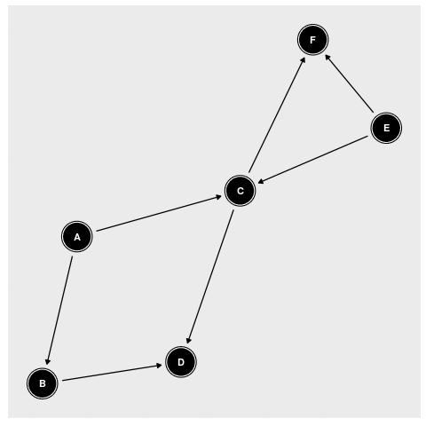

# dag_6step_epidemiology
script to build a DAG with bnlean with epidemiogogic data and apply 6 step algorithm to choice co variables with effectors and outcome descrided in Shrier and Platt

## why ?
Usually, in epidemiology, researcher presented outcome and one or more exposure/co - founder from a single logistic regression/ generalized linear models.
Theses approaches may affect and bias estimates of exposure on outcome (see Westreich, D. & Greenland,).
To avoid bias and computed risk factor with generalized linear models for each couple effectors/outcome with a specific set of confounder.
we selected best set of co founder for each couple with algorithm 6-step of Shrier and Platt apply on Directed Acyclic Graphs (DAG).
## algoritms 

##steps 1 build dag  with epidemiological data and format data for 6 step algorims
### Script : build_dag.r 
### description 
Build a Bayesian network and inference, to obtain a acyclic and directed graphics we black list some relation

### requirement 
  * R-project
    * corrplot library
    * bnlearn library
### example : see script 

##steps 2 defined covariable(s) for a specific Effector and Outcome
* Script : 6Step.version.py
* requirement 
  * python, library itertools, sys, argparse used

* options :
  * `--input_file`
     * relation parents and child : example where A parents of  B and C : A B,C

'''
A B,C
B D
C D
'''
  *  `--out_file` : output files contain list of covariable could be uses [need]
  * `--effector` : effector to analyse [need]
  * `--outcome` : outcome need to analyse in graphics [need]
  * `--excl` : list of variable to exclude, should be separate by comma [optional]
  * models of output : 
   * mc minimum covariable (Default)
   * mmc : merged minimum covariable 
   * lc : maximum covariable

* algorithms for mc :

  * we defined one effector and outcome, all other variables of the DAG are considered as putative cofactors 
  * we discarded all putative cofactors that did not validate step 1 of 6-step algorithm DAG: descent of effector in DAG
  * for each putative covariable we performed a 6-step DAG
  * if no covariable was identified in the 6-step DAG algorithms, we did all combinations of 2 covariables and ran them for each set of algorithms 
  * if no set of 2 covariables were found in previous step of the 6 steps, we did this for all combinations of  3 covariables, followed by combination of 4, 5, 6 until we obtained one or set of covariables respecting 6-step DAG algorithm
  * we computed risk factors (relative risk) of effectors on the outcome using the covariable set defined previously, covariable set used for each couple of outcome/effector is reported in Supplementary Tables 7, 8 and 9.

## Other script : 
  * `simulate_phenotype.r`: script to simulate a phenotype values with DAG know and relation between variables

## example :
* script `simulate_phenotype.r` to build simulates values of phenotype files `ressource/Pheno.sim.info`contains a relation father child and beta value, sd values

'''
A B 0.2 0.01
B D 0.15 0.005
E C -0.3 0.01
A C -0.5 0.01
C F 0.25  0.1 
E F -0.3  0.01 
C D -0.25  0.01 
'''
 * we used beta values and sd values (random normal law) and DAG to computed a phenotype for 10 000 individuals see `ressource/test_data.csv `

* build DAG :
  * we used values generated in previous step set to build DAG with bnlearn  

  * we observed a relation A<=>B so we excluded B=>A

  
  * we writed files of new DAG 

* search best covariable :
  * we used python script to generate putative covariable for effector and outcome F

'''
python  6Step.v1.1.py --input_file ressource/dag_bnlearn.tab --out_file ressource/CovEffC_F --effector C --outcome F --model mmc
'''

## How to Cite?
articles in review : revalence and Risk Factors for Chronic Kidney Disease in Four Sub-Saharan African Countries: an AWI-Gen Cross-Sectional Population Study
contact me and see bibliography

## bibliographies

* Westreich, D. & Greenland, S. The table 2 fallacy: Presenting and interpreting confounder and modifier coefficients. Am. J. Epidemiol. 177, 292–298 (2013).
* Shrier, I. & Platt, R. W. Reducing bias through directed acyclic graphs. BMC Med. Res. Methodol. 8, 70 (2008).
* Evans, D., Chaix, B., Lobbedez, T., Verger, C. & Flahault, A. Combining directed acyclic graphs and the change-in-estimate procedure as a novel approach to adjustment-variable selection in epidemiology. BMC Med. Res. Methodol. 12, 156 (2012).
* Thornley, S., Marshall, R. j, Wells, S. & Rod, J. Using Directed Acyclic Graphs for Investigating Causal Paths for Cardiovascular Disease. J. Biom. Biostat. 04, (2013).
* Margaritis, D. Learning Bayesian Network Model Structure from Data. (Carnegie-Mellon University, Pittsburgh, PA, 2003).
Scutari, M. Learning Bayesian Networks with the bnlearn R Package. J. Stat. Software, Artic. 35, 1–22 (2010).

